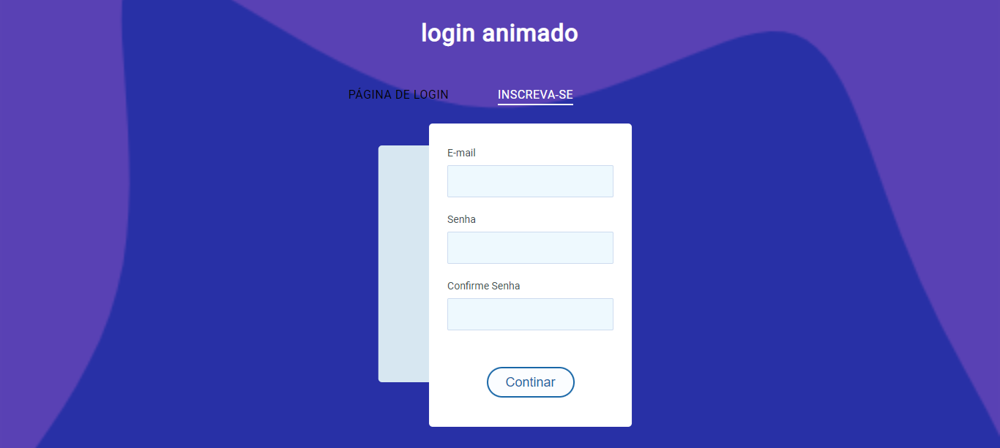

<h1 align="center"> logim animado </h1>

  

## 🚀 Tecnologias

Esse projeto foi desenvolvido com as seguintes tecnologias:

- HTML e CSS
- JavaScript
- Github

## 💻 Projeto

O login-animado é uma página de acesso.

- [Acesse o projeto finalizado, online](https://ricantony6.github.io/Login-animado/)

♥ Ricardo Antonio Rodrigues
